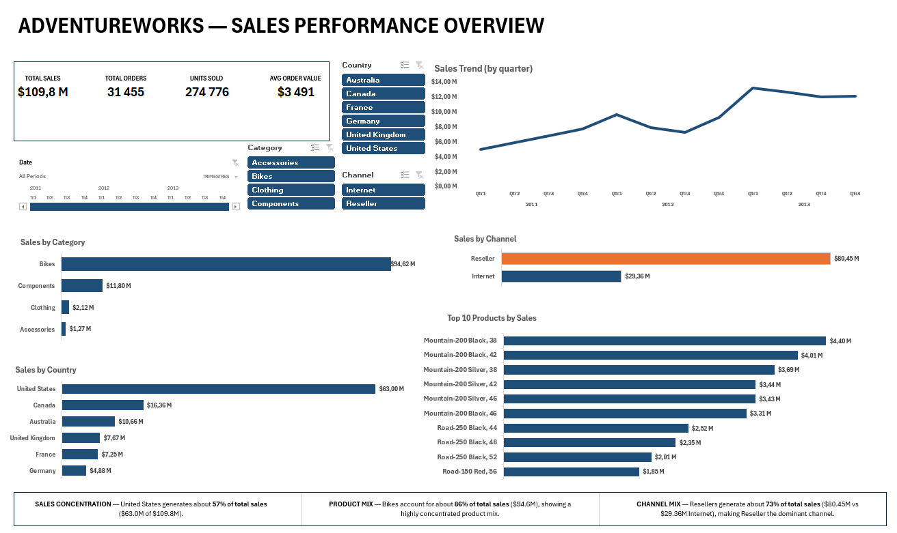
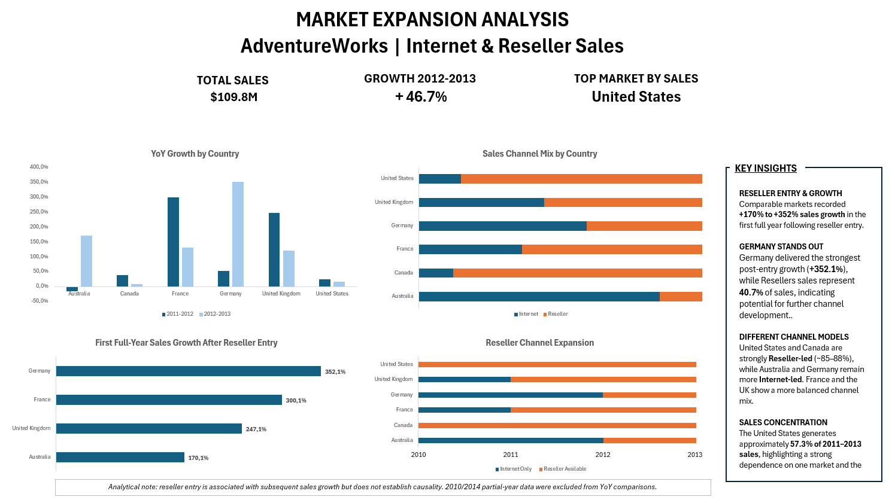

# AdventureWorks Sales & Market Expansion Analysis

## Project Overview

This project analyzes AdventureWorks sales data using **SQL Server and Excel** to evaluate overall sales performance, customer and reseller activity, geographic expansion, product mix, and sales channel development.

The objective was not only to build interactive dashboards, but also to identify meaningful business patterns and translate them into actionable insights.

The project follows a complete analytical workflow:

**SQL Server → CSV extracts → Power Query → Excel Data Model / Power Pivot → PivotTables → Interactive Dashboards → Business Insights**

---

## Tools Used

- SQL Server / SSMS
- Excel
- Power Query
- Power Pivot / Data Model
- DAX
- PivotTables & PivotCharts
- Slicers & Timeline

---

## Data Preparation

SQL queries were used to extract and prepare the main datasets from AdventureWorks:

- Internet Sales
- Reseller Sales
- Sales Quotas
- Employees
- Date dimension
- Country dimension

The datasets were then imported into Excel and transformed with Power Query.

A consolidated `All_Sales` table was created by appending Internet and Reseller sales, allowing both channels to be analyzed through a common set of dimensions.

---

## Data Model

The Excel Data Model uses shared dimensions to connect the different fact tables.

Main relationships include:

- Date → Internet Sales
- Date → Reseller Sales
- Date → Sales Quota
- Date → All Sales
- Employee → Reseller Sales
- Employee → Sales Quota
- Country → Internet Sales
- Country → Reseller Sales
- Country → All Sales

This structure allows filters to propagate consistently across the dashboards.

---

# Dashboard 1 — Sales Performance Overview

The first dashboard provides an interactive overview of overall business performance.

### KPIs

- Total Sales
- Total Orders
- Units Sold
- Average Order Value

Each KPI can display a **Year-over-Year comparison** when a valid single-year period is selected.

### Interactive Filters

- Date Timeline
- Country
- Product Category
- Sales Channel

### Main Visuals

- Quarterly Sales Trend
- Sales by Category
- Sales by Country
- Sales by Channel
- Top 10 Products by Sales



---

## Key Sales Insights

### Sales Concentration

The **United States generates approximately 57% of total sales**, highlighting a strong geographic concentration of revenue.

### Product Mix

**Bikes account for approximately 86% of total sales**, showing that AdventureWorks remains heavily dependent on its core product category.

### Channel Mix

The **Reseller channel generates approximately 73% of total sales**, making it the dominant distribution channel overall.

### Product Concentration

The highest-performing products are largely variants of the **Mountain-200** range, indicating strong revenue concentration among a relatively small number of high-value products.

---

# Dashboard 2 — Market Expansion Analysis

The second dashboard focuses on how AdventureWorks expanded geographically and how its sales channels evolved between markets.

It was designed to answer questions such as:

- When did the Reseller channel enter each market?
- How did sales evolve after reseller entry?
- Which countries experienced the strongest growth?
- How does the Internet / Reseller mix vary between markets?



---

## Market Expansion Findings

### Reseller Expansion Occurred in Waves

The reseller channel expanded progressively across markets:

- Canada and United States were already active early in the dataset.
- France and United Kingdom gained reseller activity later.
- Australia and Germany were among the latest markets to receive reseller activity.

### Strong Growth Following Reseller Entry

For markets where a full comparable year was available after reseller entry, first-full-year sales growth ranged from approximately:

**+170% to +352%**

Germany showed the strongest observed growth following reseller entry.

### Different Channel Models by Country

Distribution strategy varies significantly by market.

Some markets remain strongly Internet-oriented, while others generate the majority of their sales through resellers.

This suggests that AdventureWorks does not operate with a single distribution model across all countries.

### Geographic Concentration

The United States remains by far the largest market, creating both a strong revenue base and a potential concentration risk.

---

## Business Interpretation

The analysis suggests that reseller expansion is **associated with strong subsequent sales growth in several markets**.

However, this analysis is observational.

The dataset does not allow us to establish that reseller entry alone caused the increase in sales.

Other factors such as:

- overall business growth,
- product availability,
- market maturity,
- seasonality,
- and geographic expansion

may also contribute to the observed performance.

---

## Additional Analysis

Separate analysis sheets were also created for:

### Internet Sales

- Customer revenue segmentation
- Customer age segmentation
- Top customers
- Top products
- Country performance
- Product category performance

### Reseller Sales

- Top resellers
- Reseller size segmentation
- Annual revenue segmentation
- Employee-count segmentation
- Country performance
- Product performance

### Sales Quotas

Sales representatives were compared against their assigned sales quotas using:

- Sales Quota
- Amount Realised
- Gap
- Achievement Rate

The analysis shows a clear improvement in sales performance over the period, with overall quota achievement exceeding 100% in 2013.

---

## Repository Structure

```text
AdventureWorks-Sales-Analysis/
│
├── README.md
├── AdventureWorks_Sales_Analysis.xlsx
│
├── sql/
│   ├── SQL_Internet_Sales.sql
│   ├── SQL_Reseller_Sales.sql
│   ├── SQL_Sales_Quota.sql
│   ├── SQL_Employee.sql
│   ├── SQL_Date_2011_2013.sql
│   └── SQL_Pays.sql
│
├── data/
│   ├── 01_Internet_Sales.csv
│   ├── 02_Reseller_Sales.csv
│   ├── 03_Sales_Quota.csv
│   ├── 04_Employee.csv
│   ├── 05_Date_2011_2013.csv
│   └── 06_Pays.csv
│
└── screenshots/
    ├── sales_performance_dashboard.png
    └── market_expansion_dashboard.png
```


## Project Skills Demonstrated

SQL querying and data extraction, data cleaning and transformation with Power Query, relational data modeling, DAX measures, PivotTables, dynamic Excel dashboards, KPI design, sales analysis, market segmentation, channel analysis, business interpretation, and analytical storytelling.

---

## Limitations

- AdventureWorks is a sample dataset.
- Some years at the boundaries of the dataset contain partial sales periods and were excluded from certain year-over-year comparisons.
- Reseller entry and subsequent sales growth show association, not proven causality.
- Historical business context outside the dataset was not available.

---

## Author

**Maxime Orlhac**

Data / Business Analyst Portfolio Project
